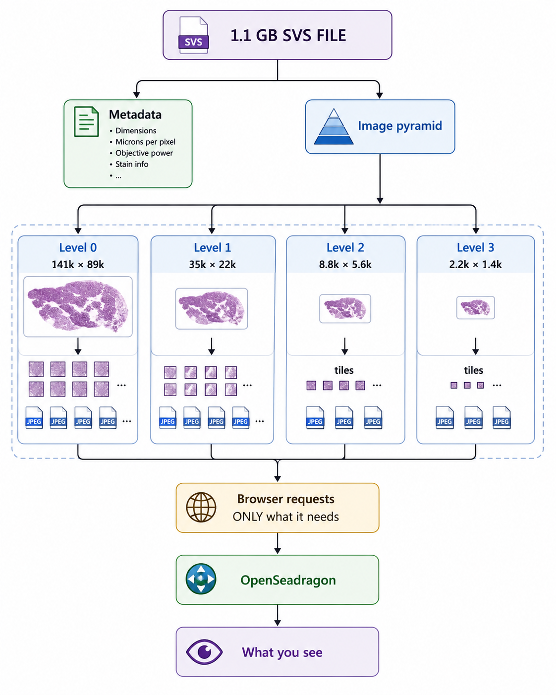

# Pathology Image Processing — TCGA BLCA FGFR3 Analysis Pipeline

**Paper:** Bannier et al. *Nature Communications* (2024) 15:10914 — "AI allows pre-screening of FGFR3 mutational status using routine histology slides of muscle-invasive bladder cancer"

**Target SVS:** `image/TCGA-FJ-A871-01Z-00-DX5.8F79D0A8-5DE6-4159-AA77-61DACB21E867.svs` (1.1 GB compressed, ~38 GB uncompressed, 141432×89585 px, 40× magnification, MPP 0.2525 µm)

---

## Repository Structure

```
Pathology_Image_Processing/
├── README.md                  # This file
├── viewer.html                # Interactive SVS viewer (OpenSeadragon)
├── favicon.svg                # Browser tab icon
├── todo.md                    # Open notes & findings
├── data/                      # Downloaded metadata & TCGA SVS files
│   ├── cbioportal_*.json      # cBioPortal API responses (mutations, expression, CNA)
│   ├── data_manifest.json     # 16,670-sample metadata manifest
│   ├── tcga_blca_slides.tsv   # TCGA BLCA slide list
│   ├── data.txt               # GDC slide metadata (472 records)
│   └── TCGA-*/                # 1,000+ TCGA SVS directories
├── image/                     # SVS slides + reference images
│   ├── TCGA-FJ-A871-*.svs     # Main slide (1.1 GB)
│   ├── TCGA-2F-A9KQ-*.svs     # Additional slides
│   ├── svs_file_format.png    # SVS internal structure diagram
│   └── TCGA-CF-A5U8-*.svs     # More slides
├── scripts/                   # All processing scripts (organized)
│   ├── preprocessing/         # Image preprocessing pipeline
│   │   ├── preprocess_pipeline.py     # Main pipeline (tissue-only filtering)
│   │   ├── patch_normalization_pipeline.py  # Macenko normalization (raw+normalized)
│   │   ├── tile_extractor.py          # Overlapping tile extraction from WSI
│   │   ├── tissue_detector.py         # Tissue/glass/focus/stain quality check
│   │   ├── background_remover.py      # Binary tissue mask (Otsu + closing)多项式
│   │   ├── noise_remover.py           # Gaussian + Median + Morphological opening
│   │   ├── color_normalizer.py        # Percentile color normalization
│   │   ├── macenko_normalizer.py      # Macenko H&E stain normalization (gold standard)
│   │   ├── 122_normalizing_HnE_images.py  # Original Macenko reference implementation
│   │   ├── config.yaml                # Pipeline configuration (patch size, thresholds, etc.)
│   │   └── test_tile.png              # Test image for preprocessing
│   ├── analysis/                # Data analysis & figure generation
│   │   ├── analyze_fgfr3_mutations.py  # FGFR3 prevalence, hotspots, VAF, expression stats
│   │   └── fetch_cbioportal_data.py    # cBioPortal API data fetcher
│   ├── annotation/              # Mutant location annotation
│   │   └── annotate_mutant_locations.py  # Locate & annotate FGFR3 mutants in slides
│   ├── utils/                   # Utility scripts
│   │   └── download_svs.sh      # Download TCGA SVS via GDC gdc-client
│   ├── config/                  # Project configuration
│   │   └── requirements.txt     # Python dependencies
│   └── docs/                    # Documentation
│       └── PREPROCESSING.md     # Detailed preprocessing guide
├── output/                    # All generated outputs
│   ├── mutation_analysis/     # Fig1-7 figures + report (FGFR3 cohort stats)
│   │   ├── fig1_prevalence.png ... fig7_histology_surrogates.png
│   │   ├── per_sample_table.csv, per_slide_table.csv
│   │   ├── cohort_FGFR3_all_records.csv
│   │   └── report.md
│   ├── mutant_locations/      # Mutant annotation outputs
│   │   ├── WHICH_IMAGES_ARE_MUTANT.csv
│   │   ├── MUT_list.txt / WT_list.txt
│   │   ├── annotated_TCGA-FJ-A871-*.png
│   │   ├── simulated_heatmap_MUT_example.png
│   │   └── GDC_fetch_MUT_images.sh
│   ├── preprocessed/          # Full pipeline output (tiles, masks, metadata)
│   ├── patches/               # Macenko patch output (raw/normalized pairs)
│   └── cbioportal_summary_all.csv
├── docs/                      # Project documentation
│   ├── PIPELINE_SUMMARY.md    # Two-pipeline comparison (preprocessing vs Macenko)
│   ├── PLAN.md                # Nucleus instance segmentation plan
│   ├── metadata_completeness_report.md
│   └── s41467-024-55331-6.pdf # Bannier et al. paper
└── .gitignore
```

---

## Quick Start

### Prerequisites

- Python 3.8+ (tested on 3.12)
- Modern browser (Chrome/Firefox) for SVS viewer
- ~15 GB RAM for full-pipeline processing (less for pipelined steps)

### Install Dependencies

```bash
pip install -r scripts/config/requirements.txt
```

For SVS viewing only:

```bash
pip install RangeHTTPServer tifffile imagecodecs Pillow
```

---

## Script Catalog

### Preprocessing (`scripts/preprocessing/`)

#### `preprocess_pipeline.py` — Main Full Preprocessing Pipeline

Orchestrates all preprocessing steps: tile extraction → noise removal → background removal → tissue detection → color normalization. Filters aggressively — only keeps high-quality tissue tiles.

**Outputs:** `output/preprocessed/tiles/`, `output/preprocessed/masks/`, `output/preprocessed/metadata/`

```bash
# Quick test (first 10 tissue patches)
python scripts/preprocessing/preprocess_pipeline.py --max-tiles 10

# Full WSI (~15-20 min CPU)
python scripts/preprocessing/preprocess_pipeline.py --all

# Custom ROI (x=12544, y=896, w=5000, h=5000)
python scripts/preprocessing/preprocess_pipeline.py --roi 12544 896 5000 5000 --max-tiles 50

# Specify config file
python scripts/preprocessing/preprocess_pipeline.py --config scripts/preprocessing/config.yaml
```

#### `patch_normalization_pipeline.py` — Macenko Normalization Pipeline

Alternative approach: extract raw patches → Macenko normalize → save raw + normalized separately (1:1 pairing). No filtering — keeps all tiles. Ideal for stain-invariant deep learning.

**Outputs:** `output/patches/raw/`, `output/patches/normalized/`, `output/patches/metadata/`

```bash
# Quick test (first 10 patches)
python scripts/preprocessing/patch_normalization_pipeline.py --max-tiles 10

# Full WSI
python scripts/preprocessing/patch_normalization_pipeline.py --all

# Custom ROI
python scripts/preprocessing/patch_normalization_pipeline.py --roi 12544 896 5000 5000 --max-tiles 20

# Custom output directory
python scripts/preprocessing/patch_normalization_pipeline.py --output-dir ../output/pilot --max-tiles 50
```

#### `tile_extractor.py` — Tile Extraction

Extracts overlapping patches from Whole Slide Images using OpenSlide. Never loads the full image into memory. Configurable patch size, overlap, and stride.

**Used by:** `preprocess_pipeline.py` and `patch_normalization_pipeline.py`

```bash
# Standalone usage (imports as module)
python -c "from scripts.preprocessing.tile_extractor import TileExtractor; ..."
```

#### `tissue_detector.py` — Tissue Detection

Identifies whether a tile contains valid tissue (not glass/background). Checks tissue percentage, focus quality (Laplacian), and staining quality (HSV).

**Used by:** `preprocess_pipeline.py`

#### `background_remover.py` — Background Removal

Creates a binary tissue mask separating tissue from glass background. Uses Grayscale Otsu + inversion + morphological closing.

**Used by:** `preprocess_pipeline.py`

#### `noise_remover.py` — Noise Removal

Applies Gaussian (k=3) → Median (k=3) → Morphological opening (disk=2) filters. Targets Gaussian sensor noise, salt-and-pepper noise, and debris.

**Used by:** `preprocess_pipeline.py`

#### `color_normalizer.py` — Percentile Color Normalization

Standardizes stain colors across tiles using per-channel percentile scaling (low=1, high=99). Fast approximate method for batch color correction.

**Used by:** `preprocess_pipeline.py`

#### `macenko_normalizer.py` — Macenko H&E Stain Normalization

Gold-standard stain normalization using SVD of optical density covariance. Aligns hematoxylin/eosin vectors to a common reference. Based on Macenko et al., ISBI 2009.

**Used by:** `patch_normalization_pipeline.py`

#### `122_normalizing_HnE_images.py` — Original Macenko Reference

Original procedural implementation of the Macenko method. Refactored into `macenko_normalizer.py` for modular use.

---

### Analysis (`scripts/analysis/`)

#### `fetch_cbioportal_data.py` — cBioPortal Data Fetcher

Downloads clinically and genomically relevant cBioPortal records for TCGA slides: mutations, expression (RSEM), CNA, patient/sample clinical data. Supports three input modes: single image, directory scan, or file-list.

**Outputs:** `data/TCGA-*/cbioportal_*.json`

```bash
# Single image
python scripts/analysis/fetch_cbioportal_data.py --image image/TCGA-FJ-A871-01Z-00-DX5.8F79D0A8-5DE6-4159-AA77-61DACB21E867.svs

# Directory scan
python scripts/analysis/fetch_cbioportal_data.py --image-dir image/ --study blca_tcga_pan_can_atlas_2018

# File-list mode (batch)
python scripts/analysis/fetch_cbioportal_data.py --file-list data/tcga_blca_file_names.txt --outdir data --batch-size 30

# Per-sample deep dive
python scripts/analysis/fetch_cbioportal_data.py --image image/TCGA-FJ-A871*.svs --outdir data
```

#### `analyze_fgfr3_mutations.py` — FGFR3 Mutation Analysis & Report

Scans cBioPortal data to compute FGFR3 prevalence, hotspot distribution, VAF, expression, stage/sex demographics, and tumor mutation burden. Generates 7 publication-quality figures + a layman-readable markdown report.

**Outputs:** `output/mutation_analysis/fig1-7_*.png`, `output/mutation_analysis/report.md`

```bash
# Full analysis
python scripts/analysis/analyze_fgfr3_mutations.py --data-dir data --out-dir output/mutation_analysis

# With higher DPI figures
python scripts/analysis/analyze_fgfr3_mutations.py --data-dir data --out-dir output/mutation_analysis --dpi 200
```

---

### Annotation (`scripts/annotation/`)

#### `annotate_mutant_locations.py` — Mutant Location Annotation

Lists which SVS files are FGFR3 mutant, explains why only one SVS is downloaded, and generates an annotated thumbnail + simulated heatmap for the mutant slide. Provides honest GDC download commands for missing MUT slides.

**Outputs:** `output/mutant_locations/WHICH_IMAGES_ARE_MUTANT.csv`, `MUT_list.txt`, `annotated_*.png`, `simulated_heatmap_*.png`

```bash
python scripts/annotation/annotate_mutant_locations.py --data-dir data --image-dir image --out-dir output/mutant_locations
```

---

### Utilities (`scripts/utils/`)

#### `download_svs.sh` — Download TCGA SVS via GDC

Downloads any TCGA SVS file by file name using the GDC gdc-client. Uses `output/tcga_blca_slides.tsv` for file ID mapping.

```bash
# Download a single slide
./scripts/utils/download_svs.sh TCGA-2F-A9KQ-01Z-00-DX1.1C8CB2DD-5CC6-4E99-A0F9-32A0F598F5F9.svs

# Download multiple slides
./scripts/utils/download_svs.sh TCGA-FD-A3NA-01Z-00-DX1.2AD62CEE-0D76-4382-AE2E-9B7FCB1130D9.svs TCGA-FJ-A871-01Z-00-DX5.8F79D0A8-5DE6-4159-AA77-61DACB21E867.svs

# Download from stdin
echo "TCGA-....svs" | ./scripts/utils/download_svs.sh

# Custom output directory
./scripts/utils/download_svs.sh -d /tmp/my_images TCGA-....svs
```

---

## SVS Viewer

The interactive SVS viewer lets you browse the full-slide image in your browser without loading the entire 38 GB into RAM. It uses tiled reading — only ~50 KB tiles are fetched on demand.

### Quick Start

```bash
# Install viewer dependencies
pip install RangeHTTPServer tifffile imagecodecs Pillow

# Start server (from repo root)
python3 -m RangeHTTPServer 8765

# or background
nohup python3 -m RangeHTTPServer 8765 > /tmp/svs_server.log 2>&1 &
echo "http://localhost:8765/viewer.html"

# Open in browser
# Main viewer:    http://localhost:8765/viewer.html
# Thumbnail:      http://localhost:8765/thumbnail.jpg
```

### How It Works

The SVS file is a tiled TIFF pyramid:

| Level        | Dimensions      | Downsample | Tiles   |
| ------------ | --------------- | ---------- | ------- |
| 0 (full)     | 141432 × 89585 | 1×        | 220,660 |
| 1            | 35358 × 22396  | 4×        | 13,912  |
| 2            | 8839 × 5599    | 16×       | 888     |
| 3 (overview) | 2209 × 1399    | 64×       | 60      |

The viewer parses the TIFF header to learn tile locations, then fetches only visible tiles via HTTP Range requests (`206 Partial Content`). A typical view uses 10-20 tiles (~2-5 MB RAM) instead of the full 38 GB.

### SVS Internal Structure



### Troubleshooting

| Problem                                       | Fix                                                          |
| --------------------------------------------- | ------------------------------------------------------------ |
| `curl Range` returns `200` + `1.1 GB`   | You're using`http.server` — switch to `RangeHTTPServer` |
| Black viewer /`GeoTIFFTileSource not found` | Wait 2s, hard-refresh`Ctrl+Shift+R`, check CDN online      |
| `Address already in use`                    | `ss -tlnp \| grep 8765` → `kill <PID>` or use `8766`   |
| `imagecodecs` error on thumbnail            | `pip install imagecodecs`                                  |

---

## Configuration

All pipeline parameters are centralized in `scripts/preprocessing/config.yaml`:

```yaml
# Patch extraction
patch_extraction:
  patch_size: 1024
  overlap: 128
  stride: 896

# Noise reduction
noise_reduction:
  method: gaussian_median

# Background removal
background_removal:
  method: otsu

# Tissue detection
tissue_detection:
  min_tissue_percent: 5.0
  focus_method: laplacian
  focus_threshold: 50.0

# Color normalization
color_normalization:
  method: percentile
  low: 1
  high: 99

# Macenko normalization
macenko_normalization: {Io: 240, alpha: 1, beta: 0.15}
```

---

## Dependencies

Install all required packages:

```bash
pip install -r scripts/config/requirements.txt
```

Core packages: `opencv-python`, `scikit-image`, `numpy`, `openslide-python`, `tifffile`, `imagecodecs`, `pyyaml`, `tqdm`

Analysis extras: `matplotlib`, `seaborn`, `pandas` (installed automatically for `analyze_fgfr3_mutations.py`)

---

## Generated Outputs

### `output/mutation_analysis/`

| File                              | Content                                                   |
| --------------------------------- | --------------------------------------------------------- |
| `fig1_prevalence.png`           | FGFR3 mutation prevalence across cohorts                  |
| `fig2_hotspots.png`             | Hotspot mutation distribution (S249C, Y373C, G370C, etc.) |
| `fig3_expression.png`           | FGFR3 expression (RSEM) comparison MUT vs WT              |
| `fig4_stage.png`                | FGFR3 mutation rate by clinical stage                     |
| `fig5_vaf.png`                  | Variant allele frequency distribution                     |
| `fig6_clinical.png`             | Age/sex/TMB vs mutation status                            |
| `fig7_histology_surrogates.png` | Histological features distinguishing MUT vs WT            |
| `per_sample_table.csv`          | One row per unique sample (278 rows)                      |
| `per_slide_table.csv`           | One row per slide image (582 rows)                        |
| `cohort_FGFR3_all_records.csv`  | 68 FGFR3 variant records                                  |
| `report.md`                     | Human-readable analysis report                            |

### `output/mutant_locations/`

| File                                  | Content                                                 |
| ------------------------------------- | ------------------------------------------------------- |
| `WHICH_IMAGES_ARE_MUTANT.csv`       | Ground-truth label for every SVS (MUT/WT, hotspot, VAF) |
| `MUT_list.txt` / `WT_list.txt`    | Plain lists for scripting                               |
| `annotated_TCGA-FJ-A871-*.png`      | Real thumbnail stamped WT with explanation              |
| `simulated_heatmap_MUT_example.png` | Educational heatmap mimicking paper Fig.2e              |
| `GDC_fetch_MUT_images.sh`           | Commands to download missing MUT slides                 |

### `output/preprocessed/`

| Directory                          | Content                                             |
| ---------------------------------- | --------------------------------------------------- |
| `tiles/`                         | Preprocessed PNG tiles (tissue-only, noise-removed) |
| `masks/`                         | Binary tissue masks                                 |
| `metadata/tiles.json`            | Tile metadata with tissue%, focus, stain quality    |
| `metadata/processing_stats.json` | Processing statistics                               |
| `metadata/report.html`           | Visual QC report                                    |

### `output/patches/`

| Directory               | Content                                           |
| ----------------------- | ------------------------------------------------- |
| `raw/`                | Raw extracted patches (before normalization)      |
| `normalized/`         | Macenko-normalized patches (1:1 pairing with raw) |
| `metadata/tiles.json` | Patch coordinates with raw/normalized filenames   |

---

## Paper Reference

> Bannier, P., et al. "AI allows pre-screening of FGFR3 mutational status using routine histology slides of muscle-invasive bladder cancer." *Nature Communications* 15, 10914 (2024).
> DOI: [10.1038/s41467-024-55331-6](https://doi.org/10.1038/s41467-024-55331-6)

---

*Generated for Pathology Image Processing Project — 2026*
